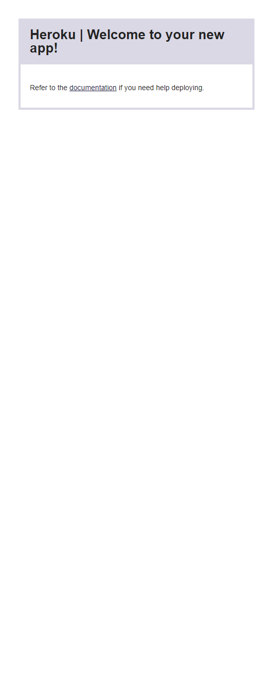

# Tech-Blog
### Creating A CMS-Style Blog Site Following The MVC Paradigm Structure, Deploying It To Heroku.
This project creates a CMS-style blog site that allows users to publish and comment on blog posts. It follows the MVC paradigm in its architectural structure using Node.js, Express, Sequelize, and Handlebars. The site is deployed thru Heroku.

## Table Of Contents
1. [Acceptance Criteria](#acceptance-criteria)
2. [Work Completed](#work-completed)
3. [Work To Be Completed](#work-to-be-completed)
4. [Deployed Application URL](#deployed-application-url)
5. [Deployed Application Screenshot](deployed-application-screenshot)
6. [Credits](#credits)

## Accpetance Criteria
- GIVEN a CMS-style blog site, WHEN I visit the site for the first time, THEN I am presented with the homepage, which includes existing blog posts if any have been posted, navigation links for the homepage and the dashboard, and the option to log in;
- WHEN I click on the homepage option, THEN I am taken to the homepage;
- WHEN I click on any other links in the navigation, THEN I am prompted to either sign up or sign in;
- WHEN I choose to sign up, THEN I am prompted to create a username and password;
- WHEN I click on the sign-up button, THEN my user credentials are saved and I am logged into the site;
- WHEN I revisit the site at a later time and choose to sign in, THEN I am prompted to enter my username and password;
- WHEN I am signed in to the site, THEN I see navigation links for the homepage, the dashboard, and the option to log out;
- WHEN I click on the homepage option in the navigation, THEN I am taken to the homepage and presented with existing blog posts that include the post title and the date created;
- WHEN I click on an existing blog post, THEN I am presented with the post title, contents, post creator’s username, and date created for that post and have the option to leave a comment;
- WHEN I enter a comment and click on the submit button while signed in, THEN the comment is saved and the post is updated to display the comment, the comment creator’s username, and the date created;
- WHEN I click on the dashboard option in the navigation, THEN I am taken to the dashboard and presented with any blog posts I have already created and the option to add a new blog post;
- WHEN I click on the button to add a new blog post, THEN I am prompted to enter both a title and contents for my blog post;
- WHEN I click on the button to create a new blog post, THEN the title and contents of my post are saved and I am taken back to an updated dashboard with my new blog post;
- WHEN I click on one of my existing posts in the dashboard, THEN I am able to delete or update my post and taken back to an updated dashboard;
- WHEN I click on the logout option in the navigation, THEN I am signed out of the site;
- WHEN I am idle on the site for more than a set time, THEN I am able to view posts and comments but I am prompted to log in again before I can add, update, or delete posts.

## Work Completed 
- Created the CMS-style blog site using Express.js, Sequelize, Handlebars, and deployed to Heroku.
- Set up the MVC paradigm structure with models, controllers, and views.
- Created models and associations for Users, Blogs/Posts, and Comments using Sequelize.
- Set up controller functions to handle GET and POST requests for signup, login, blogs, dashboard, and comments.
- Created Handlebars templates for signup, login, homepage, dashboard, blog post, and comment forms.
- Set up routes for the above pages and controller functions.
- Added login authentication using passport.js and bcrypt for password hashing.
- Added authorization middleware to restrict dashboard and account routes only to logged in users.
- Added helper functions to check for logged in user and display correct links.
- Added logout functionality to destroy session and redirect to homepage.

## Work To Be Completed
- Fixing bugs that prevent successful deployment to Heroku
- Adding additional styling and formatting to improve UI/UX
- Refining handlebars templates for cleaner code and logic

## Deployed Application URL
https://sb-tech-blog-27af0843e735.herokuapp.com/
- (Currently shows "Welcome to your new app" when trying to open application through Heroku)

## Deployed Application Screenshot

- (Currently shows "Welcome to your new app" when trying to open application through Heroku)

## Credits
- Application Built/Created by Sier Behashti
- Email: sbehashti@gmail.com GitHub: https://github.com/sbehashti

### Technologies Used:
- Node.js
- Express.js
- Sequelize (for database management)
- Handlebars.js (for templating)
- bcrypt (for hashing passwords)
- passport.js (for authentication)
- express-session (for session management)
- dotenv (for environment variables)
- MySQL (database)
- Visual Studio Code (code editor)
- Heroku (deployment platform)
- GitHub (for version control)
- JavaScript (programming language)
- CSS (cascading style sheets, for styling)